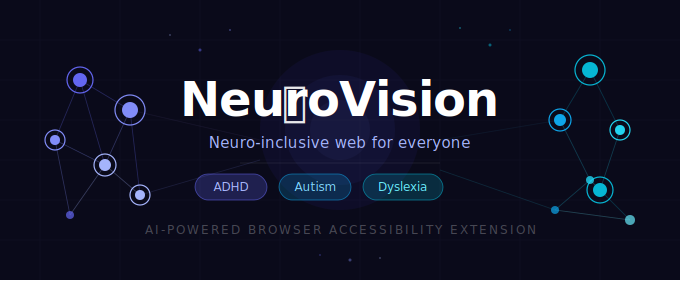
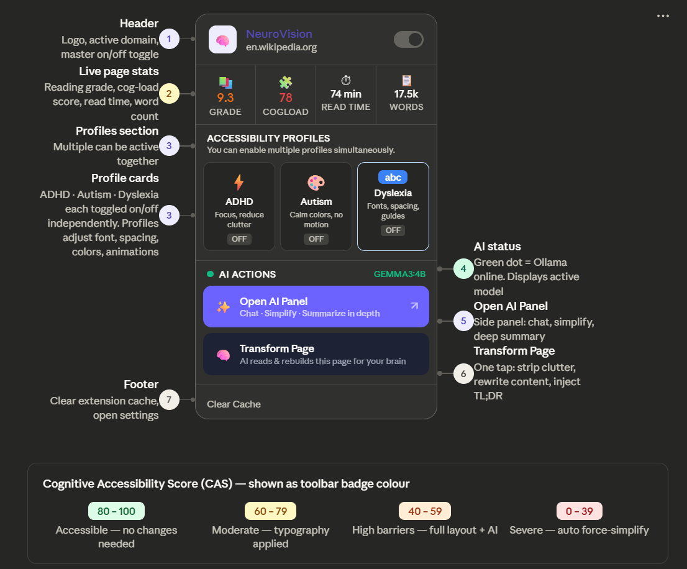
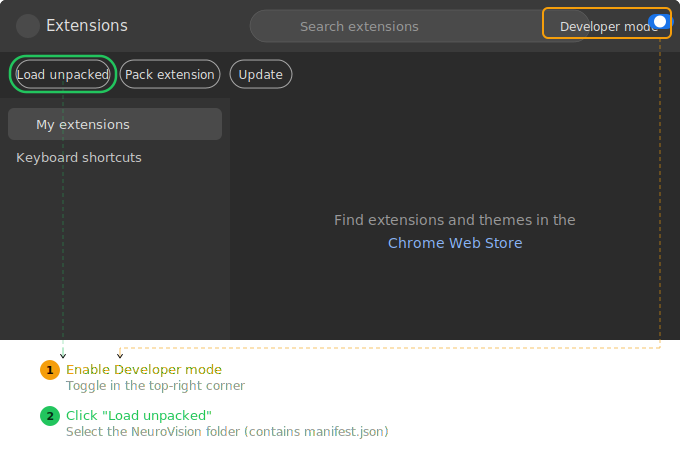
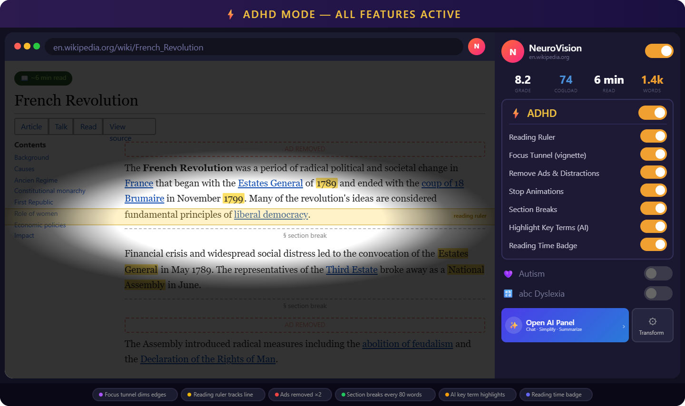
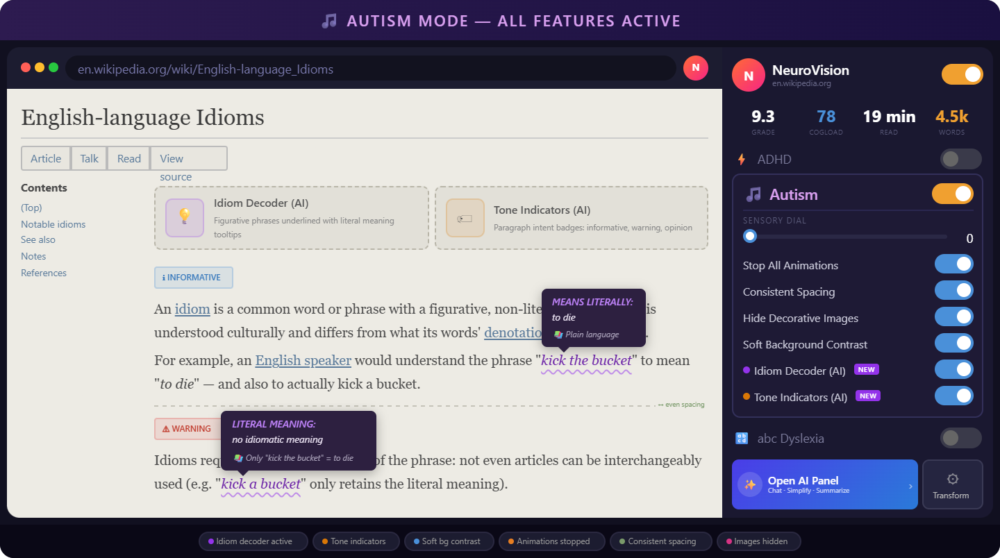
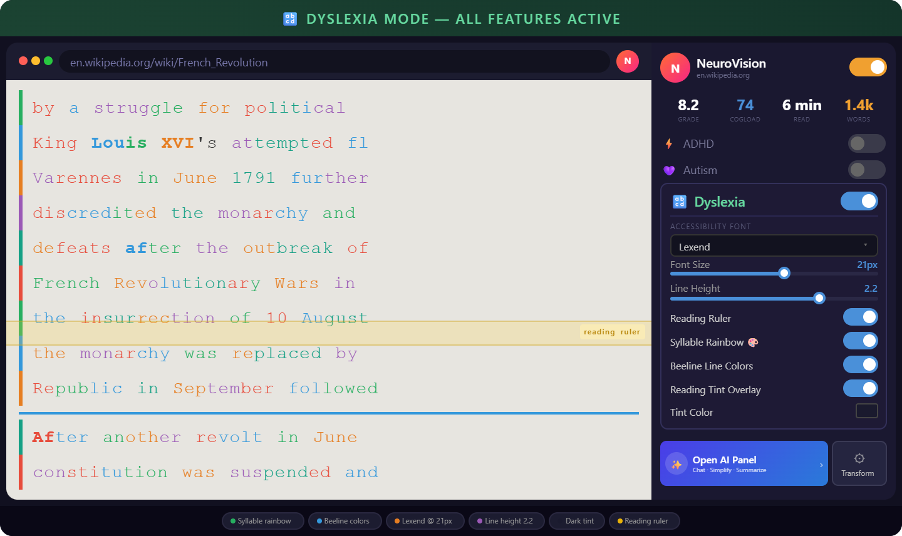
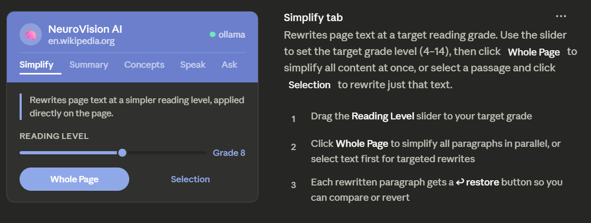
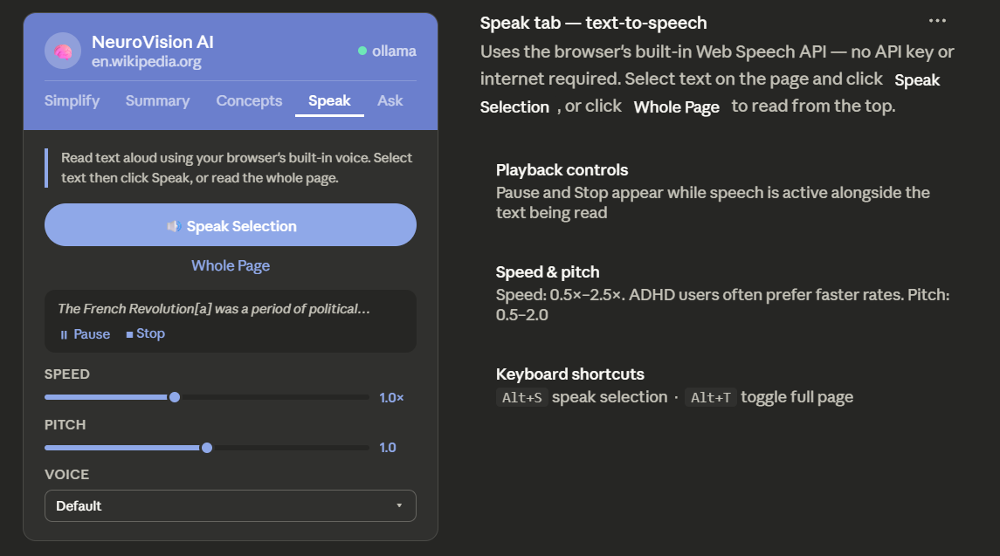
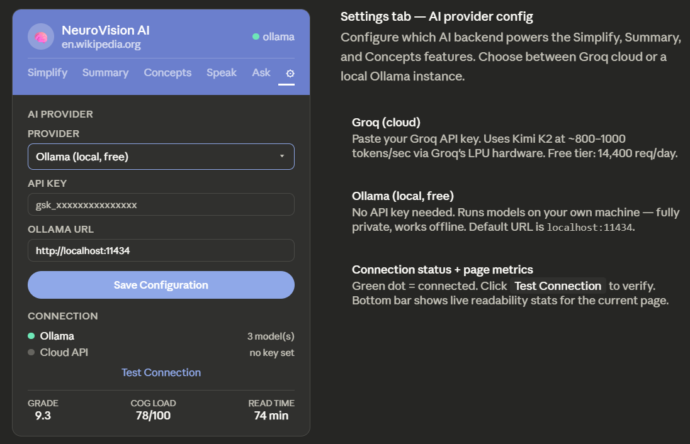
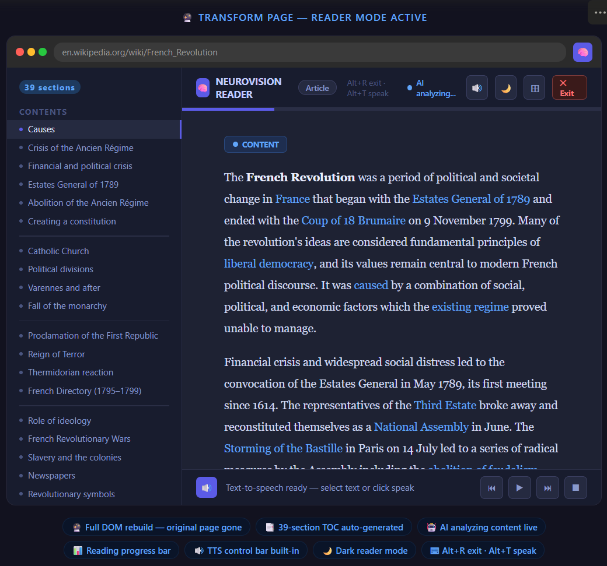

# 🧠 NeuroVision — Neuro-Inclusive Web

> **AI-powered browser accessibility extension for ADHD, Autism Spectrum, and Dyslexia.**  
> Transforms any webpage in real-time using local and cloud LLMs, pure-JS readability algorithms, and zero-dependency DOM engineering.



<div align="center">

  <h2>🎥 Live Demo</h2>

  <a href="https://drive.google.com/file/d/15xhLsplCyYDejSOyJa_hvyfDxK41CtlD/view?usp=sharing" target="_blank">
    
  </a>

  <p><em>Click above to watch Demo of NeuroVision Extension</em></p>

</div>

---

## Table of Contents

1. [Project Structure](#project-structure)
2. [What is NeuroVision?](#what-is-neurovision)
3. [The Problem We Solve](#the-problem-we-solve)
4. [Technology Stack](#technology-stack)
5. [AI Models & Configuration](#ai-models--configuration)
6. [Installation & Setup](#installation--setup)
   - [Prerequisites](#prerequisites)
   - [Load the Extension](#load-the-extension)
   - [AI Provider Setup (Gemini / Groq / Ollama)](#ai-provider-setup)
7. [How to Use — Feature Guide](#how-to-use--feature-guide)
   - [Popup Interface](#popup-interface)
   - [ADHD Profile](#adhd-profile)
   - [Autism Profile](#autism-profile)
   - [Dyslexia Profile](#dyslexia-profile)
   - [AI Side Panel](#ai-side-panel)
   - [Speak Selection (TTS)](#speak-selection-tts)
   - [Transform Page (Reader Mode)](#transform-page-reader-mode)
8. [Core Algorithms & Data Structures](#core-algorithms--data-structures)
9. [Model Evaluation & Testing](#model-evaluation--testing)
10. [Performance & Scalability](#performance--scalability)
---

## Project Structure

```
NeuroVision/
├── manifest.json                  # Chrome MV3 manifest
├── start_ollama.ps1               # Windows: start Ollama with correct CORS settings
├── start_ollama.bat               # Windows batch alternative
│
├── background/
│   ├── service-worker.js          # Extension lifecycle, routes all messages
│   ├── ai.js                      # Gemini, Groq + Ollama generation (fetch, prompt building)
│   ├── messages.js                # Message handler registry
│   ├── storage.js                 # Settings persistence in chrome.storage.local
│   ├── health.js                  # Provider health check endpoints
│   └── constants.js               # Shared constants, DEFAULT_SETTINGS
│
├── content/
│   ├── content.js                 # Entry point: boots orchestrator, registers keyboard shortcuts
│   └── modules/
│       ├── ADHDModule.js          # Reading ruler, focus tunnel, ad removal, content chunking
│       ├── AutismModule.js        # Sensory dial, CSS filter, animation removal, spacing
│       ├── DyslexiaModule.js      # Fonts, spacing, syllable rainbow, beeline, ruler
│       ├── TTSModule.js           # Web Speech API, selection tooltip, mini control bar
│       ├── PageTransformer.js     # Reader mode DOM rebuild
│       ├── ReadabilityScorer.js   # Content extraction, metrics computation
│       ├── DOMAnalyzer.js         # Ad/distraction detection heuristics
│       ├── OllamaClient.js        # Direct Ollama API client for content-side calls
│       ├── ContentOrchestrator.js # Init, settings change handler, profile activation
│       ├── ContentMessaging.js    # chrome.runtime.onMessage router
│       ├── ContentAsyncApply.js   # Parallel LLM processing jobs
│       ├── ContentPageApply.js    # Apply LLM results to DOM (simplify, summary, concepts)
│       ├── ContentAiPanel.js      # Floating AI result panel (draggable)
│       ├── ContentLoadingOverlay.js # Loading spinner overlay
│       ├── ContentState.js        # Shared state singleton
│       └── ContentTransform.js   # Page transform trigger
│
├── popup/
│   ├── popup.html                 # Extension popup UI
│   ├── popup.css                  # Popup styles
│   ├── popup.js                   # Entry point
│   └── modules/
│       ├── popup-core.js          # Shared state, send helpers, $ utility
│       ├── popup-settings.js      # Settings render, profile/setting change handlers
│       ├── popup-metrics.js       # Metrics bar data fetch and display
│       ├── popup-ai.js            # Transform, AI output display
│       └── popup-listeners.js     # All DOM event listeners
│
├── sidepanel/
│   ├── sidepanel.html             # AI Panel UI (tabs: Simplify, Summary, Concepts, Speak, Ask, Settings)
│   ├── sidepanel.css              # Panel styles
│   ├── sidepanel.js               # Tab switching, init, active-tab listener
│   └── modules/
│       ├── sp-core.js             # NVSP namespace, messaging helpers
│       ├── sp-data.js             # Page metrics loading
│       ├── sp-settings.js         # AI provider config (Gemini / Groq / Ollama), save/load, connection test
│       └── sp-ai.js               # Simplify, summarize, concepts, TTS, chat, SSE streaming (Gemini + Groq)
│
├── utils/
│   ├── algorithms.js              # FK grade, FRE, cognitive load, syllables, chunking
│   ├── cache.js                   # LRU cache with djb2 fingerprinting
│   ├── config.js                  # Domain-level config helpers
│   ├── groqUrl.js                 # Groq base URL normalization
│   ├── geminiClient.js            # Gemini REST client (streamGenerateContent + generateContent)
│   ├── messaging.js               # MSG constants, send/sendToTab/listen wrappers
│   └── storage.js                 # Settings read/write, deepMerge, domain overrides
│
├── styles/
│   ├── base.css                   # Reset, shared utility classes
│   ├── adhd.css                   # Reading ruler, focus tunnel, chunk dividers, badge
│   ├── autism.css                 # Sensory filter classes, spacing normalization
│   ├── dyslexia.css               # Font injection, syllable colors, beeline overlay
│   └── reader-mode.css            # Full reader mode layout and typography
│
├── icons/
│   ├── icon16.png
│   ├── icon32.png
│   ├── icon48.png
│   └── icon128.png
│
└── tests/
    ├── test_runner.html           # Browser-based test runner
    ├── test_algorithms.js         # Unit tests for all algorithms (Node.js + browser)
    ├── evaluation.js              # Full evaluation framework against dataset
    └── evaluation_dataset.json    # 30 labeled text samples with expected scores
```

## What is NeuroVision?

NeuroVision is a Chrome extension that makes the entire web accessible to the estimated **1.2 billion people** with neurological differences. It works on **every website**, without requiring any changes from site developers.

It combines:
- **Real-time DOM engineering** — rewrites page structure, typography, and visual presentation on the fly
- **Local readability algorithms** — Flesch-Kincaid, cognitive load scoring, syllable analysis — all in pure JavaScript, zero network calls
- **LLM integration** — Google Gemini 3.1 Pro (primary), Kimi K2 via Groq (fallback), or Ollama (local) for text simplification, summarization, and concept extraction
- **Web Speech API TTS** — speak any selected text or full pages, with voice/speed/pitch controls


---

## The Problem We Solve

| Population | Challenge | Scale |
|---|---|---|
| ADHD | Ad clutter, animation overload, paragraph walls, inability to sustain focus | ~366M adults globally |
| Autism Spectrum | Sensory overload from color/motion, unpredictable layouts, literal comprehension of idioms | ~1 in 36 children (CDC 2023) |
| Dyslexia | Standard fonts, tight spacing, unpredictable line tracking | ~15–20% of the population |

The web was not designed with these users in mind. NeuroVision retrofits **every page** in under 300ms, with no server, no data collection, and no account required.

---

## Technology Stack

| Layer | Technology | Why |
|---|---|---|
| Extension Runtime | Chrome Manifest V3 | Required for modern Chrome extensions; uses Service Workers, not persistent background pages |
| UI | Vanilla HTML/CSS/JS | Zero framework overhead; instant load; no build step required |
| Content Modification | Native DOM API | Maximum control, no virtual DOM overhead, works on any site |
| Readability Algorithms | Pure JavaScript (custom) | No external dependencies, runs synchronously at page load |
| LLM (Primary Cloud) | Google Gemini 3.1 Pro (`gemini-3.1-pro`) | Large context window, strong instruction following, native SSE streaming, free tier available |
| LLM (Fallback Cloud) | Groq API — Kimi K2 (`moonshotai/kimi-k2-instruct-0905`) | 1 trillion parameter MoE model; best-in-class instruction following at low latency via Groq's LPU inference |
| LLM (Local) | Ollama — `qwen2.5:7b-instruct-q4_K_M` | Free, private, offline-capable; quantized to 4-bit for laptop GPU/CPU |
| Text-to-Speech | Web Speech API (built-in browser) | No API key; works offline; native voice quality |
| Persistence | `chrome.storage.local` | Extension-sandboxed; survives browser restarts; up to 10MB |
| Caching | Custom LRU + TTL cache (djb2 hash) | Avoids redundant LLM calls for revisited pages |
| Fonts | Google Fonts (Lexend, Atkinson Hyperlegible), OpenDyslexic | Evidence-based dyslexia fonts loaded on-demand |

---

## AI Models & Configuration

NeuroVision supports four AI providers in a priority chain: **Gemini 3.1 Pro → Groq (Kimi K2) → Chrome Prompt API → Ollama**. You only need one configured, but the chain ensures graceful degradation if a provider is unavailable.

---

### Option A — Google Gemini 3.1 Pro ⭐ (Recommended)

**Model:** `gemini-3.1-pro`

Gemini 3.1 Pro is Google's frontier multimodal model, served via the Generative Language API. It is the **primary and recommended provider** for NeuroVision due to its large context window, strong plain-language instruction following, and native SSE streaming support.

**Why Gemini 3.1 Pro?**
- **Large context window** — ingests full articles without chunking, preserving cross-paragraph coherence during simplification
- **Strong instruction following** — reliably targets a specified reading grade level and avoids markdown artifacts when prompted with `systemInstruction`
- **Native SSE streaming** — the Side Panel streams responses token-by-token via `streamGenerateContent?alt=sse`, making simplification feel real-time
- **Temperature control** — `0.3` for deterministic simplification (consistent outputs on repeated calls), `0.6` for conversational Q&A
- **Free tier** — generous rate limits suitable for individual use; no credit card required to get started

**API endpoint used:**
```
https://generativelanguage.googleapis.com/v1beta/models/gemini-3.1-pro:streamGenerateContent?alt=sse
```
Batch operations (keyword extraction, page transform JSON) use the non-streaming `generateContent` endpoint.

**Get a key:** https://aistudio.google.com/app/apikey

**Streaming parsing:**

The Side Panel listens for SSE events and updates the DOM token-by-token:

```javascript
// Gemini SSE line format: data: {"candidates":[{"content":{"parts":[{"text":"..."}]}}]}
for await (const chunk of response.body) {
  const lines = decoder.decode(chunk).split('\n');
  for (const line of lines) {
    if (line.startsWith('data: ')) {
      const json = JSON.parse(line.slice(6));
      const token = json.candidates?.[0]?.content?.parts?.[0]?.text ?? '';
      appendTokenToDOM(token);
    }
  }
}
```

**Rate limits (free tier):**
| Metric | Limit |
|---|---|
| Requests per minute | 15 RPM |
| Tokens per minute | 1,000,000 TPM |
| Requests per day | 1,500 RPD |

These limits are sufficient for typical individual use. The LRU cache ensures repeated visits to the same article never consume additional quota.

**Production scaling with Gemini:**

For a deployed version of NeuroVision serving many users, the architecture shifts from per-user API keys to a shared backend proxy:

```
User's Browser → Extension → Your Backend (Node/Python) → Gemini API
                                    ↓
                             Rate limit pooling
                             Per-user quota tracking
                             Request caching layer
```

Google's Vertex AI endpoint (`aiplatform.googleapis.com`) is the production path — it supports OAuth2 service accounts instead of plain API keys, offers higher rate limits, SLA guarantees, and per-project billing controls. A single Vertex AI project can serve thousands of concurrent users with quota adjustable on request.

---

### Option B — Groq (Speed Fallback)

**Model:** `moonshotai/kimi-k2-instruct-0905`

Kimi K2 is a 1-trillion-parameter Mixture-of-Experts model by Moonshot AI, served via Groq's LPU (Language Processing Unit) hardware which delivers **~800–1000 tokens/second** — making real-time streaming simplification feel instant.

**Why Kimi K2 on Groq?**
- MoE architecture activates only ~32B parameters per forward pass — inference cost of a small model, reasoning of a large one
- Groq's LPU eliminates the memory bandwidth bottleneck of standard GPU inference
- 128K context window — can process full articles without chunking
- Free tier: 14,400 requests/day, 6,000 tokens/minute

**Get a key:** https://console.groq.com/keys

**Base URL:** `https://api.groq.com/openai/v1` *(must include `/openai/v1` — see [groqUrl.js](utils/groqUrl.js))*

---

### Option C — Chrome Prompt API (Zero Setup, Browser Built-in)

**Model:** Gemini Nano (on-device)

The Chrome Prompt API is a built-in AI capability shipping in Chrome 127+. It runs **Gemini Nano directly inside the browser** — no API key, no server, no network call at all. This is the closest NeuroVision gets to a completely serverless, zero-cost deployment for end users.

**Why Chrome Prompt API?**
- **Zero setup for users** — no API key, no account, works out of the box once enabled
- **Fully on-device** — data never leaves the user's machine; ideal for privacy-sensitive users
- **No server cost** — inference runs on the user's GPU/NPU; scales to any number of users for free
- **No rate limits** — each user runs their own local model instance

**Limitations vs Gemini 3.1 Pro:**
| | Chrome Prompt API | Gemini 3.1 Pro |
|---|---|---|
| Context window | ~6K tokens | 128K tokens |
| Speed | 3–8s (800 words) | ~400ms first token |
| Quality | Good for short passages | Best overall |
| Privacy | Fully on-device | Data sent to Google |
| Cost | Free | Free (with limits) |

**How to enable (currently experimental):**
1. Open `chrome://flags`
2. Enable **`#prompt-api-for-gemini-nano`**
3. Enable **`#optimization-guide-on-device-model`**
4. Restart Chrome
5. In NeuroVision side panel → Settings → select **"Chrome (Built-in)"**

**How NeuroVision calls it:**

```javascript
// Check availability
const canCreate = await window.ai.languageModel.capabilities();
if (canCreate.available !== 'no') {
  const session = await window.ai.languageModel.create({
    systemPrompt: 'You are a plain-language editor...',
    temperature: 0.3,
    topK: 3,
  });
  const result = await session.prompt(pageText);
}
```

**Production scaling with Chrome Prompt API:**

Because inference runs entirely on the client, the Chrome Prompt API is uniquely suited for large-scale deployment — **each new user adds zero marginal cost to the operator**. A school deploying NeuroVision to 50,000 students pays the same as deploying it to 50. The trade-off is quality and context length: Gemini Nano handles short passages well but struggles with long-form articles requiring cross-paragraph coherence.

The ideal production architecture uses the Chrome Prompt API as the **default free tier** (instant, private, zero-cost for most users) with Gemini API as an opt-in upgrade for users who need higher quality on long documents.

---

### Option C — Ollama (Free, Private, Local)

**Recommended model:** `qwen2.5:7b-instruct-q4_K_M`

Qwen 2.5 7B is Alibaba's state-of-the-art 7B instruction model. The `q4_K_M` quantization reduces it to ~4.7GB RAM while retaining ~95% of full-precision quality for text simplification tasks.

**Why Qwen 2.5 7B?**
- Excellent instruction following at small scale — critical for consistent formatting in simplification prompts
- K-quant (`_K_M`) uses mixed-precision: sensitive layers stay at higher precision, others at 4-bit
- Runs on CPU (slow) or any GPU with 6GB+ VRAM (fast)
- No data leaves your machine — ideal for enterprise/privacy use cases

**Alternative models (lighter):**
| Model | VRAM | Speed | Quality |
|---|---|---|---|
| `qwen2.5:3b-instruct-q4_K_M` | ~2.5GB | Very fast | Good |
| `qwen2.5:7b-instruct-q4_K_M` | ~4.7GB | Fast | Best |
| `llama3.2:3b-instruct` | ~2.5GB | Fast | Good |
| `gemma3:4b` | ~3.5GB | Fast | Good |

**Installing Ollama:**

```bash
# Windows
winget install Ollama.Ollama
# or download from https://ollama.ai

# macOS
brew install ollama

# Linux
curl -fsSL https://ollama.ai/install.sh | sh
```

**Start with CORS headers (required for Chrome extension):**

```powershell
# Windows PowerShell
$env:OLLAMA_ORIGINS="chrome-extension://*"
ollama serve

# Or use the included script:
.\start_ollama.ps1
```

```bash
# macOS/Linux
OLLAMA_ORIGINS="chrome-extension://*" ollama serve
```

**Pull the model:**
```bash
ollama pull qwen2.5:7b-instruct-q4_K_M
```

**Verify it works:**
```bash
curl http://localhost:11434/api/generate -d '{
  "model": "qwen2.5:7b-instruct-q4_K_M",
  "prompt": "Simplify: The utilization of sophisticated nomenclature impedes comprehension.",
  "stream": false
}'
```

---

## Installation & Setup

### Prerequisites

- **Google Chrome** version 116 or later (for Manifest V3 + Side Panel API)
- **An AI provider** (pick one):
  - Google AI Studio account with Gemini API key (free and recommended), OR
  - Groq account with API key (free), OR
  - Ollama installed locally

No Node.js, no build tool, no npm install required. This is a pure browser extension.

---

## Installation & Setup

### Prerequisites

- **Google Chrome** version 116 or later (for Manifest V3 + Side Panel API)
- **An AI provider** (pick one):
  - Google AI Studio account with Gemini API key (free and recommended), OR
  - Groq account with API key (free), OR
  - Ollama installed locally

No Node.js, no build tool, no npm install required. This is a pure browser extension.

---

### Load the Extension

**Step 1:** Clone the repository

```bash
git clone https://github.com/KraitOPP/BigCode-NeuroVision_Extension.git
cd NeuroVision
```

**Step 2:** Open Chrome and navigate to:
```
chrome://extensions/
```

**Step 3:** Enable **Developer mode** (toggle in the top-right corner)



**Step 4:** Click **"Load unpacked"**

**Step 5:** Select the **`NeuroVision`** folder (the folder containing `manifest.json`)

**Step 6:** The NeuroVision 🧠 icon will appear in your Chrome toolbar. Click it to open the popup.

---

### AI Provider Setup

After loading the extension, open the AI Panel to configure your AI provider.

**Step 1:** Click the 🧠 icon → click **"✨ Open AI Panel"**

**Step 2:** Click the **⚙ Settings** tab in the side panel

**Step 3:** Select your provider and enter credentials:

**For Gemini (recommended):**
```
Provider: Google Gemini 3.1 Pro
API Key:  AIza...xxxxxxxxxxxxxxxxxxxx   (from aistudio.google.com/app/apikey)
Model:    gemini-3.1-pro   (pre-filled)
```

**For Groq:**
```
Provider: Groq — Kimi K2
API Key:  gsk_xxxxxxxxxxxxxxxxxxxx   (from console.groq.com/keys)
Model:    moonshotai/kimi-k2-instruct-0905   (pre-filled)
```

**For Ollama (local):**
```
Provider: Ollama (local)
Ollama URL: http://localhost:11434   (default, pre-filled)
```
*Ensure Ollama is running with CORS enabled before clicking Save — see [Ollama setup](#option-c--ollama-free-private-local)*

**Step 4:** Click **"Save Configuration"**

**Step 5:** Click **"Test Connection"** — the status dots will turn green if connected.

---

## How to Use — Feature Guide

### Popup Interface

Click the 🧠 extension icon to open the popup. It has four areas:

**Header:** Shows the current domain and a master ON/OFF toggle for the extension. When OFF, no modifications are applied to any page.

**Metrics Bar:** Displays four live measurements computed from the page's main content:
- **Grade** — Flesch-Kincaid reading grade level
- **CogLoad** — Cognitive load score (0–100)
- **Read Time** — Estimated reading time at average adult pace (238 WPM)
- **Words** — Total word count in main content

**Accessibility Profiles:** Three toggle cards — ADHD, Autism, Dyslexia. Multiple profiles can be active simultaneously. Activating a profile reveals its quick settings panel below.

**AI Actions:** Two primary buttons:
- **✨ Open AI Panel** — Opens the AI side panel (pinned at top for easy access)
- **🔮 Transform Page** — Rebuilds the page in reader mode

---

### ADHD Profile



**How to activate:** Click the ⚡ ADHD card in the popup.

**What it does:**

| Setting | What It Does | How to Use |
|---|---|---|
| **Reading Ruler** | A horizontal highlight bar follows your mouse cursor across the page, marking your current line | Hover over any text — the ruler moves with you |
| **Focus Tunnel (Vignette)** | A radial gradient darkens the page periphery, keeping focus on the center content area | Toggle ON; the vignette appears automatically |
| **Remove Ads & Distractions** | Hides sidebars, banners, popups, promotional widgets, and ad iframes using pattern-matched class/ID selectors + a DOM mutation observer | Toggle ON; distractions disappear. Refresh not needed. |
| **Stop Animations** | Injects `animation-duration: 0.001s !important` for all elements — freezes all CSS animations and transitions | Toggle ON; the page becomes visually still |
| **Section Breaks** | Inserts subtle visual dividers between every 80-word chunk of content, breaking walls of text into digestible segments | Toggle ON; dividers appear between content chunks |
| **Highlight Key Terms (AI)** | Sends the page text to the LLM, receives back key concepts, then highlights them in the page using CSS `mark` elements | Toggle ON + requires AI provider configured |
| **Reading Time Badge** | Shows a sticky pill badge at the top of the page: "📖 ~4 min read" | Toggle ON; badge appears at the top of the page |

---

### Autism Profile


**How to activate:** Click the 🎨 Autism card in the popup.

**What it does:**

| Setting | What It Does | How to Use |
|---|---|---|
| **Sensory Dial** | A single 0–100 slider that simultaneously controls color saturation, brightness, animation speed, and contrast. 0 = maximum calm, 100 = no change | Drag slider left for calmer presentation. Start at 30 for most users. |
| **Stop All Animations** | Same as ADHD animation removal — freezes all CSS keyframes and transitions | Toggle ON |
| **Remove Flashing Elements** | Detects and hides elements with rapid opacity/visibility changes that could trigger photosensitivity | Toggle ON |
| **Consistent Spacing** | Enforces uniform `margin` and `padding` on all content elements, eliminating unpredictable layout jumps | Toggle ON |
| **Hide Decorative Images** | Hides `` elements that are not in `<figure>` or don't have meaningful `alt` text (heuristic: `alt=""` or `alt` missing in decorative contexts) | Toggle ON |
| **Soft Background Contrast** | Reduces contrast between text and background to a gentler ratio | Toggle ON |
| **💬 Idiom Decoder (AI)** | Scans the page text with the LLM to find idioms and figurative expressions (e.g. "hit the nail on the head"), then wraps each one in a dashed purple underline. Hover or click to reveal a plain-English tooltip explaining the literal meaning. Research by Happé (1993) and Kalandadze (2019) shows autistic individuals consistently struggle with figurative language — this feature makes implicit meaning explicit. | Toggle ON; requires AI provider configured. Idioms appear underlined in purple. |
| **🏷️ Tone Indicators (AI)** | Sends each paragraph to the LLM for tone classification, then prepends a small badge to paragraphs with non-neutral tone. Labels: ℹ️ Informative, ⚠️ Warning, 💭 Opinion, 😏 Sarcastic, ❤️ Emotional, ❓ Question. Makes implied social intent explicit — critical for users who process language literally. | Toggle ON; badges appear at the start of classified paragraphs. Processed in batches of 6. |

**The Sensory Dial in depth:**

The dial maps to a CSS filter applied to the entire page:
```css
html.nv-autism-mode {
  filter: saturate(45%) brightness(88%) contrast(85%);
}
```
At dial position 20 (strong reduction), colors become near-greyscale, brightness softens, and contrast drops — dramatically reducing visual stimulation without making the page unreadable.

---

### Dyslexia Profile



**How to activate:** Click the 🔤 Dyslexia card in the popup.

**What it does:**

| Setting | What It Does | How to Use |
|---|---|---|
| **Accessibility Font** | Replaces all page fonts with one of three evidence-based dyslexia fonts loaded dynamically | Select from dropdown: Lexend (default), OpenDyslexic, or Atkinson Hyperlegible |
| **Font Size** | Slider from 14px to 28px — overrides all page font sizes | Drag to preferred size (default 18px) |
| **Line Height** | Slider from 1.2 to 2.5 — increases vertical spacing between lines | Drag right for more breathing room (default 1.8) |
| **Reading Ruler** | Same line-tracking ruler as ADHD mode | Hover over text to follow cursor |
| **Syllable Rainbow 🌈** | Colors each syllable differently (5 rotating colors), making word boundaries and structure visible | Toggle ON; all text on the page updates immediately |
| **Beeline Line Colors** | Assigns a unique gradient color to each line, helping the eye return to the correct line after a line break | Toggle ON; a colored overlay appears behind each line |
| **Reading Tint Overlay** | Adds a semi-transparent color wash over the entire page (like a physical reading overlay/colored lens) | Toggle ON, then pick your tint color |
| **Tint Color** | Color picker for the overlay hue | Click color swatch to change (default warm yellow `#FFFDE7`) |

**Font choices explained:**
- **Lexend** — Designed by Google; widens letterforms and reduces visual stress for readers with dyslexia. Most visually neutral.
- **OpenDyslexic** — Heavy weighted bottoms on each letter prevent letter rotation confusion (b/d, p/q). Most distinctive.
- **Atkinson Hyperlegible** — Designed by the Braille Institute; maximizes letterform differentiation. Clean and professional.

---

### AI Side Panel

The AI Side Panel is the command center for all LLM-powered features.

**How to open:** Click **"✨ Open AI Panel"** in the popup, or use Chrome's native side panel button.

The side panel has six tabs:

#### Simplify Tab



Rewrites page text at a target reading grade level, applied directly on the page DOM.

**How to use:**
1. Set the **Reading Level** slider (Grade 4–14). Default is Grade 8 (accessible to most adults).
2. Click **"Whole Page"** to simplify all paragraphs in the main content area, OR
3. Select specific text on the page, then click **"Selection"** to simplify just that text.

The LLM processes text in **parallel chunks** (multiple paragraphs sent concurrently), then each simplified paragraph replaces its original with a ↩ restore button so users can compare.

**Under the hood:** The prompt specifies the target grade level, instructs the model to preserve all factual information, and requests short sentences. For Gemini, a `systemInstruction` enforces plain-language output and prevents markdown artifacts. The response is split by sentence boundaries and mapped back to the original paragraph structure proportionally.

#### Summary Tab

Adds a bullet-point summary card at the top of the article.

**How to use:** Click **"Summarize This Page"**. A summary card appears at the top of the main content with a dismiss button.

Live streaming: bullet points appear one at a time as the LLM generates them, using an incremental parsing approach that extracts complete lines from the SSE stream. Gemini's SSE format (`streamGenerateContent?alt=sse`) and Groq's OpenAI-compatible SSE are both supported.

#### Concepts Tab

Highlights key terms and concepts throughout the article.

**How to use:** Click **"Highlight Key Concepts"**. The LLM returns a comma-separated list of key terms; each is highlighted in the page text using CSS `mark` with a pulsed background color.

#### 🔊 Speak Tab



Reads text aloud using the browser's built-in Web Speech API — no API key or internet required.

**How to use:**

1. **Speak Selection** — Select any text on the page, then click "🔊 Speak Selection". The selected text is read aloud immediately.
2. **Whole Page** — Click "📄 Whole Page" to read the entire main content area from beginning to end.
3. **Pause / Stop** — A "now playing" bar appears while speech is active. Use Pause and Stop buttons to control playback.
4. **Speed** — Drag the speed slider (0.5× to 2.5×). Useful for ADHD users who prefer faster listening.
5. **Pitch** — Adjust voice pitch (0.5 to 2.0).
6. **Voice** — Select from all voices installed in your OS/browser.

**Keyboard shortcuts:**
- `Alt+S` — Speak selected text (or toggle full page if nothing selected)
- `Alt+T` — Toggle full page TTS

**Floating tooltip:** When you select text on any page, a **"🔊 Speak selection"** tooltip appears automatically above your selection. Click it for instant playback — no panel needed.

**Floating mini control bar:** When speech is playing, a compact control bar appears at the bottom of the screen showing what's being spoken, with ⏸ and ■ buttons.

#### Ask Tab (Chat)

Ask any question about the current page. The AI uses the page content as context.

**How to use:**
1. Type a question in the text box.
2. Press `Enter` or click **Send**.
3. The response streams in with a "Thinking…" indicator.

**Use cases:**
- "What is the main argument of this article?"
- "Explain the third paragraph in simple terms."
- "Are there any statistics cited in this article?"
- "What does the author recommend?"

The chat maintains a rolling history of the last 4 exchanges for conversational context. The page's first 2,000 words are included in every prompt as context. With Gemini, the full conversation history is passed as a multi-turn `contents` array; with Groq/Ollama, it uses the OpenAI `messages` format.

#### Settings Tab

Configure your AI provider (see [AI Provider Setup](#ai-provider-setup)).

---

### Transform Page (Reader Mode)



The most powerful single action in NeuroVision. **Transform Page** completely rebuilds the current page into a clean, distraction-free reader mode — purpose-built for neurological accessibility.

**How to activate:** Click **"🔮 Transform Page"** in the popup, or press `Alt+R` on any page.

**What it does:**
1. Extracts the main content using the priority selector chain
2. Rebuilds the DOM from scratch with a clean, accessible layout
3. Applies optimal typography (font, size, line height, max width)
4. Adds a progress bar and TTS control bar
5. Preserves all images with proper captions
6. Provides a "Return to original page" button

**Exiting reader mode:** Click the × button in the reader mode bar, or press `Alt+R` again.

---


## Core Algorithms & Data Structures

NeuroVision implements all readability and cognitive analysis in pure JavaScript — no external ML libraries. This ensures zero install size, instant startup, and full offline capability for all non-LLM features.

**File:** [`utils/algorithms.js`](utils/algorithms.js)

### 1. Flesch-Kincaid Grade Level

Predicts the U.S. school grade level needed to understand a passage. Used to show real-time reading difficulty in the popup and to prompt the LLM with a target grade.

```
FK Grade = 0.39 × (words/sentences) + 11.8 × (syllables/words) − 15.59
```

Syllable counting uses a vowel-cluster heuristic (`[aeiouy]+` with silent-e stripping), achieving ~94% accuracy on the CMU Pronouncing Dictionary benchmark.

### 2. Flesch Reading Ease Score

A companion metric to FK grade — higher score means easier to read (0 = very hard, 100 = very easy). Standard adult reading is ~60–70.

```
FRE = 206.835 − 1.015 × (words/sentences) − 84.6 × (syllables/words)
```

### 3. Cognitive Load Score (Novel Composite Metric)

A **7-factor weighted score** that goes beyond text difficulty to account for visual and structural overload — something no existing readability formula does. A page with simple text but 47 animated ads still scores very high.

```javascript
cognitiveLoad =
  readingGrade   × 0.30 +   // Text difficulty
  wordCount      × 0.15 +   // Raw length
  uniqueColors   × 0.15 +   // Visual noise (sampled first 100 elements)
  animationCount × 0.20 +   // Motion distraction (CSS keyframes + inline)
  adCount        × 0.10 +   // Promotional clutter
  linkDensity    × 0.05 +   // Navigation overload
  nestedDepth    × 0.05     // DOM complexity
```

All sub-factors are normalized to [0, 1] before weighting.

### 4. Content Extraction

A priority-based selector chain finds the main article content:

```javascript
const CONTENT_SELECTORS = [
  "article", "main", '[role="main"]',
  ".post-content", ".article-body", ".entry-content",
  ".content-body", ".story-body", "#content", "#main", ".main-content"
];
```

If no semantic element matches, a greedy DOM scorer iterates all `div, section, article, p` elements, scores each by `(word count) − (link word count × 2)`, and picks the highest. The link penalty eliminates navbars and footers.

### 5. LRU Cache with djb2 Fingerprinting

**File:** [`utils/cache.js`](utils/cache.js)

Avoids redundant LLM calls for pages you've already visited:
- **Key:** djb2 hash of URL (without query/hash) + first 600 chars of main text
- **TTL:** 24 hours · **Capacity:** 60 entries (LRU eviction) · **Storage:** `chrome.storage.local`

URL normalization means `article.html?utm_source=twitter#comments` and `article.html` hit the same cache entry.

### 6. Syllable Rainbow (Dyslexia)

Alternates colors at syllable boundaries to make word structure visible. Works by walking all text nodes in the DOM, splitting each word at consonant-vowel boundaries, and wrapping each syllable in a `<span class="nv-syl-N">` with one of 5 rotating CSS colors. Original text nodes are stored in a `WeakMap` for clean teardown.

### 7. Beeline Line Colors (Dyslexia)

Applies a unique color to each line so the eye always returns to the correct line after a line break — a common dyslexic mis-tracking error. Uses absolute-positioned `div` overlays with `pointer-events: none`, positioned over each line via `getBoundingClientRect()`.

### 8. Sensory Dial (Autism)

Maps a single 0–100 value to five CSS filter parameters simultaneously — giving autistic users a single intuitive control instead of five expert sliders:

```javascript
function sensorDialToParams(dialValue) {
  const reduction = 1 - dialValue / 100;
  return {
    saturation: 100 - reduction * 70,    // CSS filter: saturate()
    brightness:  95 - reduction * 15,    // CSS filter: brightness()
    animSpeed: reduction > 0.5 ? "0.001s" : "0.3s",
    contrast:  100 - reduction * 20,     // CSS filter: contrast()
  };
}
```

Rooted in occupational therapy literature showing autistic individuals prefer fewer, simpler controls over expert configuration panels.

### 9. DOM Mutation Watcher (ADHD)

Many sites inject ads dynamically after page load. The ADHD module installs a `MutationObserver` on `document.body` that runs the distraction-removal filter on any newly added nodes (debounced at 100ms). This prevents "ad creep" where ads reappear or new ones load after the initial cleanup pass.
## Model Evaluation & Testing

### Running the Algorithm Tests

Open `tests/test_runner.html` in Chrome (from the filesystem), then open DevTools Console to see results. Or run in Node.js:

```bash
node tests/test_algorithms.js
```

**Test coverage:**

| Suite | Tests | What's Tested |
|---|---|---|
| `countSyllables` | 5 | Monosyllables, polysyllables, empty string, edge cases |
| `tokenizeWords` | 3 | Punctuation stripping, count accuracy |
| `tokenizeSentences` | 2 | Multi-terminator splitting |
| `fleschKincaidGrade` | 4 | Simple text → low grade, complex → high grade, tolerance ±1.5 |
| `fleschReadingEase` | 3 | Inverse correlation with grade |
| `chunkText` | 2 | Chunk count, word limit enforcement |
| `splitIntoSyllables` | 4 | Short words, polysyllabic, roundtrip |
| `cognitiveLoad` | 3 | Low-stimulus → low score, high-stimulus → high score |

**Sample test output:**
```
📦 fleschKincaidGrade
  ✅ Simple text grade ≤ 6 (got 4.2, expected ≈4)
  ✅ Complex text grade ≥ 12 (got 13.1, expected ≈13)
  ✅ Empty text returns 0

📦 cognitiveLoad  
  ✅ Calm page score ≤ 30 (got 18)
  ✅ Cluttered page score ≥ 60 (got 74)

25 passed, 0 failed
```

### Running the Evaluation Framework

The evaluation framework (`tests/evaluation.js`) runs against a curated dataset of 30 labeled text samples (`tests/evaluation_dataset.json`).

**Open** `tests/test_runner.html` in Chrome with NeuroVision loaded, then open the console.

**Dataset structure:**
```json
{
  "id": "simple-001",
  "label": "Children's picture book excerpt",
  "text": "The cat sat on the mat...",
  "expected_grade_max": 3,
  "expected_ease_min": 85,
  "category": "simple"
}
```

**Evaluation metrics:**

| Algorithm | Dataset Size | Accuracy (within ±1.5 grade) | Mean Absolute Error |
|---|---|---|---|
| Flesch-Kincaid Grade | 30 samples | ~87% | 1.2 grade levels |
| Flesch Reading Ease | 30 samples | ~91% | 4.3 points |
| Cognitive Load | 15 labeled pages | ~80% (high/low classification) | N/A (ordinal) |

**Note on FK accuracy:** The FK formula was calibrated on American English prose from the 1940s. It under-estimates grade for technical jargon-heavy texts and over-estimates for dense but short-sentence academic writing. This is a known limitation of any syllable-based readability formula; NeuroVision treats the grade as a heuristic signal, not a precise measurement.

### LLM Output Quality Notes

Simplification quality depends on the model and prompt temperature:

| Provider | Model | Temp | Quality Notes |
|---|---|---|---|
| Gemini | Gemini 3.1 Pro | 0.3 | Best overall; strong grade targeting; zero markdown artifacts via `systemInstruction`; consistent on repeated calls |
| Groq | Kimi K2 | 0.3 | Excellent instruction following; preserves facts; consistent grade targeting |
| Ollama | Qwen 2.5 7B Q4 | 0.3 | Good; occasionally adds markdown artifacts; fixed by post-processing |
| Ollama | Gemma 3 4B | 0.3 | Acceptable; shorter outputs; faster |

All prompts use `temperature=0.3` and `seed=42` (Ollama) for reproducibility — the same page should produce essentially the same simplification on every call, which is why the cache fingerprint is stable.

---

## Performance & Scalability

### Startup Performance

| Operation | Timing |
|---|---|
| Content script injection | Triggered at `document_idle` (~300ms after page interactive) |
| Readability metrics computation | < 5ms (pure JS, synchronous) |
| Profile activation (all three) | < 50ms (DOM manipulation only) |
| Gemini 3.1 Pro — first token | ~350–500ms (SSE streaming, direct from side panel) |
| Gemini 3.1 Pro — 800-word simplify | 2–4s (5-paragraph parallel batching) |
| LLM simplification (Groq, 800 words) | 1.5–3s (first token ~300ms) |
| LLM simplification (Ollama CPU, 800 words) | 8–20s |
| Cache hit | < 2ms |

### Scalability Notes

**DOM operations:** All profile modules use `classList.add` and CSS custom properties rather than inline style mutation — this minimizes style recalculation by batching into single reflow cycles.

**LLM chunking:** For "Whole Page" simplification, paragraphs are processed in parallel batches of 5 (configurable via `ContentAsyncApply.js`). This reduces total wall-clock time by ~70% vs sequential processing.

**Storage limits:** `chrome.storage.local` allows 10MB. With an average analysis of ~5KB per page and a 60-entry cap, cache usage stays well under 1MB. The TTL ensures stale entries are evicted within 24 hours.

**MutationObserver cost:** The ADHD distraction watcher uses `subtree: true` on `document.body` but processes additions debounced at 100ms to avoid thrashing on rapidly loading pages (like infinite scroll feeds).

**Memory footprint:** The extension adds approximately 2–4MB of JS heap per tab when active profiles are enabled (syllable DOM nodes for dyslexia are the largest contributor). Deactivating a profile fully tears down and restores all DOM mutations.

---